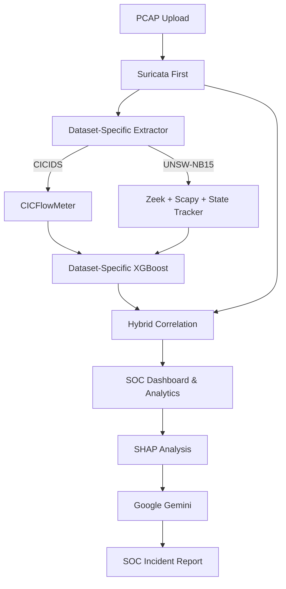

# 🛡️ ZYDER

### Hybrid AI-Driven Network Intrusion Detection System

ZYDER is a hybrid **Network Intrusion Detection System (NIDS)** combining **Machine Learning, Signature-Based Detection, Explainable AI, and Generative AI** for network security analysis.

It uses **XGBoost + Suricata** for hybrid detection, **CICFlowMeter** for network-flow extraction, **SHAP** for explainability, and **Google Gemini** for SOC-oriented incident reports.

> **Current scope:** ZYDER analyzes uploaded `.pcap` and `.pcapng` files. Real-time live traffic monitoring is not currently implemented.

<p align="center">


</p>

---

## ✨ Features

* 🧠 Hybrid Detection — **XGBoost + Suricata**
* 📁 PCAP/PCAPNG Analysis — **CICFlowMeter**
* 🔎 Explainable AI — **SHAP**
* 🤖 AI Incident Reports — **Google Gemini**
* 🖥️ SOC Dashboard — **FastAPI + JavaScript**
* 📊 Security Analytics & Incident Management
* 🧪 ML Training & Evaluation Utilities

---

## 🏗️ Architecture



---

## 🛠️ Technology Stack

**Language:** Python 3.13.0
**Backend:** FastAPI
**ML:** XGBoost · Scikit-learn
**Network:** CICFlowMeter · Zeek · Scapy · Suricata
**Explainability:** SHAP
**GenAI:** Google Gemini
**Frontend:** HTML · JavaScript · TailwindCSS · Chart.js
**Datasets:** CICIDS2017 · UNSW-NB15

---

## 📂 Project Structure

```text
ZYDER/
├── api.py
├── main.py
├── frontend/
├── detection/
├── preprocessing/
├── explainability/
├── reporting/
├── genai/
├── training/
├── evaluation/
├── models/
├── config/
├── results/
├── requirements.txt
├── README.md
└── SETUP.md
```

Large datasets, PCAP files, virtual environments, generated outputs, and secrets are excluded from Git.

---

## 🚀 Quick Start

### Clone

```bash
git clone https://github.com/Shaurya-Chauhan-16/ZYDER.git
cd ZYDER
```

### Create Environment

```bash
python3.13 -m venv .venv
source .venv/bin/activate
```

### Install Dependencies

```bash
pip install -r requirements.txt
```

### Configure Gemini

```bash
export GEMINI_API_KEY="your_api_key"
```

### Start ZYDER

```bash
.venv/bin/python api.py
```

Dashboard:

```text
http://127.0.0.1:8000
```

API Docs:

```text
http://127.0.0.1:8000/docs
```

### 📖 Complete Setup Guide

For complete installation, Suricata setup, datasets, configuration, testing, and troubleshooting:

**→ [Read SETUP.md](SETUP.md)**

---

## 🔬 Detection Pipeline

```text
PCAP / PCAPNG
      ↓
SURICATA (First Layer)
      ↓
DATASET-SPECIFIC FEATURE EXTRACTION
(CICFlowMeter OR Zeek + Scapy + Tracker)
      ↓
DATASET-SPECIFIC XGBOOST
      ↓
SURICATA + ML CORRELATION (Hybrid Verdict)
      ↓
SHAP EXPLAINABILITY
      ↓
GOOGLE GEMINI (SOC Report)
```

---

## 🧠 Explainability

ZYDER uses **SHAP** to identify the features that contribute to an XGBoost prediction, helping analysts understand the reasoning behind ML-based detections.

---

## 🤖 AI Incident Reporting

ZYDER combines available detection evidence including:

* XGBoost prediction
* ML confidence
* Suricata alerts
* SHAP feature contributions
* Network-flow metadata

Google Gemini generates a structured **SOC-oriented incident report** from this evidence.

---

## 🔬 Research

ZYDER explores the combination of:

**Signature Detection + Machine Learning + Explainable AI + Generative AI**

The project features a rigorously audited, mathematically validated native PCAP-to-UNSW-NB15 feature extraction pipeline, bridging the gap between historical dataset ML models and live traffic ingestion.

The project is intended for **network-security research, experimentation, and academic use**.

---

## ⚠️ Limitations

* PCAP/PCAPNG analysis only
* No real-time traffic monitoring
* Suricata & Zeek require separate installations
* **UNSW-NB15 Feature Limitations:** `ct_state_ttl` cannot be perfectly reconstructed from live PCAPs as the original dataset employs an unpublished categorical mapping. UDP packet loss (`sloss`/`dloss`) is identically constrained to 0 as per the original methodology.
* Large datasets are not included
* Gemini reporting requires an API key

---

## 📜 License

MIT License

---

## 👤 Author

**Shaurya Chauhan**


[GitHub](https://github.com/Shaurya-Chauhan-16)
